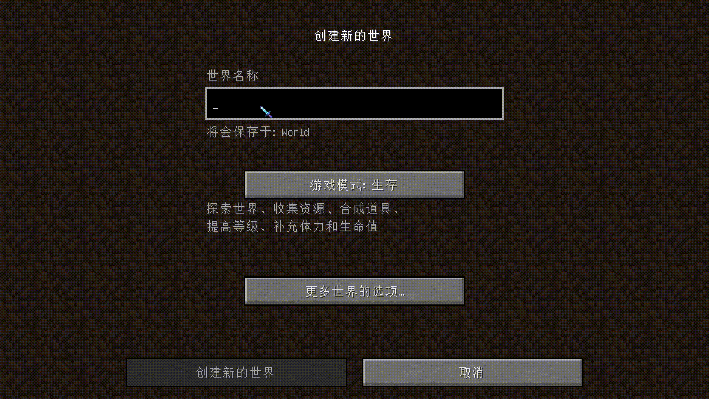

# IngameIME-Minecraft-1.12.2

Use `InputMethod` in **Full screen** Minecraft!

## Preview

[//]: # (### Window Mode)

[//]: # (![Window Mode]&#40;docs/WindowInput.gif&#41;)

[//]: # ()
### Full screen Mode

## Special Thanks
- [Windmill-City](https://github.com/Windmill-City):Module founder
- [Kappa-maintainer](https://github.com/kappa-maintainer):The biggest contributor, helped with most of the bugs and provided solutions
- [tttsaurus](https://github.com/tttsaurus):Helped to fix the bug of InGameInfoXML 
- [Andrea Frederica](https://github.com/AndreaFrederica):Patched a possible unknown crash issue with LoliASM(maybe
- There will be more in the future :)

## Bug
- Unable to enter in the search box of JEI/HEI(Fixed in 0.0.7)
- Unable to enter text in Xaero's Minimap interface(Fixed in 0.0.9)
- Can't type text into Minecraft signs(Fixed in 0.1.0)

## Supported Platforms

| Platform | Supported |
|----------|-----------|
| Windows  | √         |
| Linux    | ×         |
| MacOS    | ×         |
